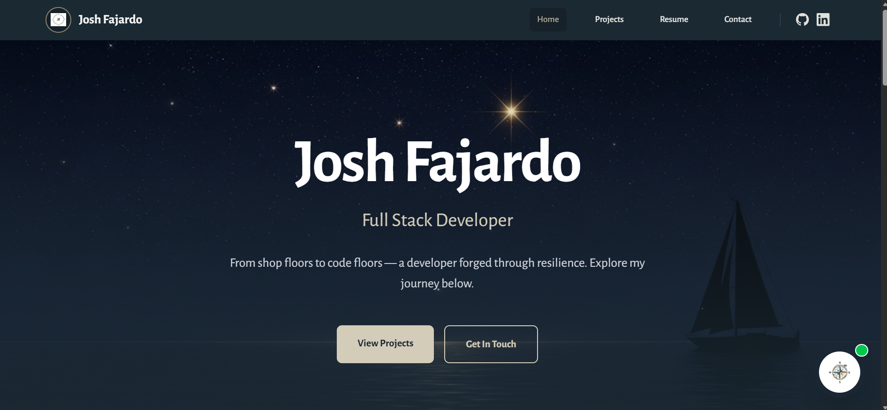
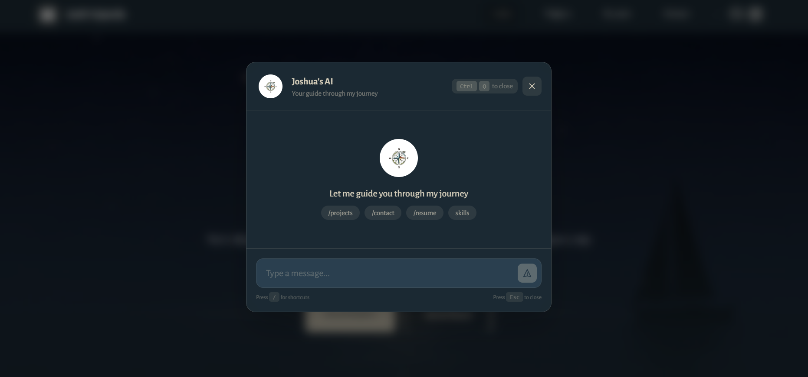

# Josh Fajardo - Full Stack Developer Portfolio



A modern, AI-powered portfolio showcasing full-stack development skills with a unique journey from shop floors to code floors.

## Tech Stack



### Frontend
- **Astro** - Static site generator for blazing fast performance
- **React** - Interactive UI components
- **Tailwind CSS** - Beautiful styling
- **TypeScript** - Type-safe development

### Backend
- **Rust + Axum** - High-performance backend API
- **SQLite** - Lightweight database for contact form
- **OpenRouter** - AI-powered chatbot with context from summary_of_me.md

### AI Features
- 🤖 Intelligent chatbot that knows Josh's background
- 🧭 Compass UI that spins when chat opens
- ⚡ Slash commands (/projects, /contact, /resume)
- ⌨️ Keyboard shortcuts (Ctrl+Q to toggle chat)

## Quick Start

```bash
# Install dependencies
npm install

# Launch development server (builds frontend + starts Rust backend)
npm run launch

# Visit http://localhost:3000
```

## Features

- 🚀 Single command: `npm run launch` builds everything and starts the server
- 💬 AI chatbot with knowledge about Josh's journey, skills, and projects
- 📱 Fully responsive design
- 🎨 Obsidian-style modal with blurred backdrop
- 🔒 API keys protected in backend/.env (gitignored)
- 🎯 Slash commands for instant navigation

## Project Structure

```
portfolio/
├── src/              # Astro + React frontend
├── backend/          # Rust Axum API
│   └── src/
│       ├── main.rs           # Server entry point
│       └── api_handlers/      # API endpoints
├── public/           # Static assets
└── dist/            # Built frontend (gitignored)
```

## AI Chatbot

The chatbot reads from `summary_of_me.md` to answer questions about:
- Josh's background and journey
- Technical skills (React, Rust, AI tools)
- Projects (Panday, portfolio)
- Work experience
- Career goals

Ask it anything about Josh!

## Keyboard Shortcuts

- `Ctrl+Q` - Open/close AI chat
- `Esc` - Close chat modal
- `/projects` - Navigate to projects
- `/contact` - Navigate to contact
- `/resume` - Navigate to resume

---

Built with ❤️ by Josh Fajardo
